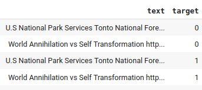
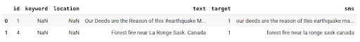

# NPL ¿Real o No? NLP con Tweets de Desastres
Predecir cuáles Tweets son sobre desastres reales y cuáles no 

+ Daniel Fernando Acosta González
+ Johan David Marin Benjumea

## Descripción del problema

Twitter se ha convertido en un importante canal de comunicación en situaciones de emergencia.
La omnipresencia de los smartphones permite a las personas anunciar una emergencia que están
observando en tiempo real. Por este motivo, más actores como organizaciones de atención a
desastres y agencias de noticias, están interesadas en monitorear periódicamente esta
red social.

Sin embargo, no siempre es claro si las palabras de una persona realmente anuncian un desastre.
Como en el ejemplo de la imagen. El autor puede usar de manera explícita la
expresión “ABLAZE” que puede traducirse como “en llamas” pero referirse a ella metafóricamente.
Esto es claro para una persona, especialmente con ayudas visuales pero, es menos claro para
una máquina.

El objetivo de este proyecto es construir un modelo de Machine Learning que prediga cuáles
tweets son sobre desastres reales y cuáles no lo son. El proyecto parte de una competición de
[kaggle](https://www.kaggle.com/c/nlp-getting-started/data?select=test.csv).

## Dataset

Se tiene acceso a un conjunto de datos (dataset) de 10000 tweets que fueron clasificados a mano.
Para realizar el ajuste de un modelo se dividen los datos en dos archivos. uno para entrenamiento
con 7613 registros y los 2387 restantes para test. Organizados en un fichero aparte cada uno. Cada
uno de los registros posee varias columnas explicadas más adelante.

### Ficheros
  + train.csv
  + test.csv

## Modelos

### Metrica de desempeño

### Desempeño en producción

Se puede esperar que el modelo sirva como una herramienta que provea alertas tempranas a organismos 
de socorro y agencias de noticias. Por otro lado, en cuanto al desempeño del modelo, el 54.5% de los
modelos previamente ajustados por otros participantes han superado 0.8 en F1. Se considera entonces
que este modelo puede tener un desempeño adecuado y posiblemente brinda buenas oportunidades a 
organismos de socorro y agencias de noticias si se supera el 0.8 en F1. Una herramienta de alertas 
tempranas para una agencia de noticias podría significarle un considerable aumento en primicias y para 
un organismo de socorro podría significar reducir sus tiempos de atención. Alcanzado el desempeño 
propuesto en el modelo, se puede aumentar considerablemente el desempeño operacional de estas 
organizaciones.

## Exploración  y limpieza de datos

Inicialmente se realizó una exploración de los datos en el archivo de train con la instrucción 
describe, que realiza un análisis estadístico básico del conjunto de datos, observando primero
si existían tuplas (text, target) duplicadas, encontrando un total de 620 registros duplicados,
los cuales se removieron dejando solamente un registro de cada tipo. Luego se realizó la misma 
búsqueda pero esta vez basados solo en la variable text, en este caso se encontró un total de 
146 tweets duplicados y clasificados en ambas categorías, como se muestra en la figura 2. 
Al hacerse imposible  determinar si son desastres o no, se eliminan, quedando con un total 
de 6847 de los 7613 totales, 2801 de los cuales son tweets de desastres reales y 4046 que no lo son.

### Metodo 1

Para realizar todo el proceso de limpieza de los datos y evaluación de modelos se  desarrolló un módulo:
`NPLtweet`. Este contiene dos funciones de limpieza diferentes, 5 funciones para crear corpus, 
listas de palabras, remover palabras, concatenar strings y comparar conjuntos de palabras, una 
función para dibujar word clouds, una función para guardar la información de los modelos y una
para graficar el desempeño de los mismos con distintas condiciones y valores de los paŕametros.
La primera limpieza se realiza utilizando la función `NPLtweet.clean()` que se apoya en el uso de
Regular expression operations ( paquete `re`) y, principalmente, las funciones `re.sub()`, `re.compile()`, 
y `re.findall()`, para reemplazar cadenas de caracteres, crear expresiones regulares y buscar coincidencias
en el texto respectivamente. La función de limpieza `NPLtweet.clean()`, recibe un tweet y elimina 
URLs, Hashtags, Tags y emoticones. Además, reemplaza contracciones por palabras completas, elimina
caracteres especiales generados por la sintaxis html y markdown y elimina la puntuación, retornando
un texto limpio. Se aplica esta función al conjunto de train, utilizando las funciones propias
de python, `apply()` y `lambda`, agregando la variable sms al data frame como se muestra en la siguiente
figura.  

Se realiza una exploración de los datos con el fin de comparar la longitud de los mensajes que  hacen referencia
a un desastre y aquellos que no. Se asigna el color rojo a los tuits que reflejan desastre y color verde para el
caso contrario. Las longitudes de los mensajes no parecen reflejar alguna tendencia ligada al target, por lo que
dicha “variable” no sería relevante en el análisis.

Mediante la función split y un filtro, se crea un listado de palabras, con todos los tweets para cada una de las etiquetas, es decir, los que se refieren a un desastre (1) y los que no (0). Luego, utilizando la función Counter() del paquete collections se crea la función NPLtweet.compare_most_commom(), cuyo objetivo es comparar las palabras más frecuentes en ambas etiquetas, implicando que estas, son principalmente palabras que se cree no son relevantes para clasificar el tweet como desastre o no. Estos casos son evidentes en los artículos, conjunciones, preposiciones, pronombres, verbos modales, adverbios, entre otras. Sin
